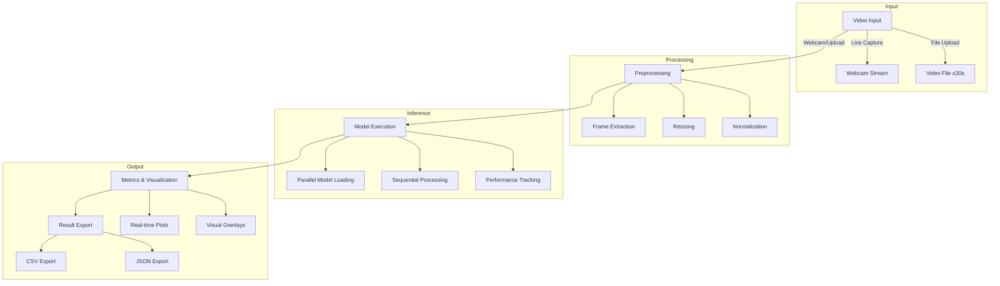

[📊 VIBE](https://github.com/rayan-elidrissi/VIBE) • [🔗 Code](https://github.com/rayan-elidrissi/VIBE)


---

## Overview

VIBE is an interactive benchmarking platform that enables real-time evaluation of computer vision models through a unified interface. The system supports multiple input modalities (video upload, webcam streaming) and vision tasks (detection, segmentation, tracking, captioning).

---

## How It Works


<div style="display: flex; gap: 2rem; align-items: flex-start">

<div style="flex: 1">


<div style="margin: 2rem 0">
<div class="video-grid" style="display: grid; grid-template-columns: repeat(3, 1fr); gap: 1rem;">
    
    
    
    
    
</div>
</div>

*Click any video to run benchmarks*
</div>

<div style="flex: 1">
| Model   | Latency (ms) | mAP  | Consistency | Memory |
|---------|--------------|------|-------------|--------|
| Model A | 140         | 72.4% | 0.88       | 4.3 GB |
| Model B | 160         | 74.1% | 0.86       | 5.1 GB |
| Model C | 128         | 70.7% | 0.90       | 3.8 GB |

- Average Processing Speed: 145ms/frame
- GPU Memory Peak: 5.1 GB 
- Inference Stability: 0.88
- Detection Accuracy: 72.4% mAP
</div>

</div>

## Bibtex
```bibtex
@inproceedings{elidrissi2025vibe,
    title={VIBE: Video Interaction Benchmark Environment},
    author={El Idrissi Dafali, Rayan and Glushkova, Alina},
    booktitle={Extended Proceedings of the 36th Francophone Conference on Human-Computer Interaction},
    year={2025},
    publisher={ACM},
    series={IHM '25}
}
```
